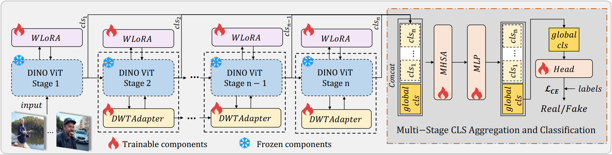

# FreqDINO

## Introduction
We provide code for the reproduction of the main results in [FreqDINO: Frequency-Aware Adaptation of Vision Transformers for AI-Generated Content Detection](). 

## Preparation
### Installation
`pip install -r requirements.txt`.

### Data and Weights
The dataset we use in the paper can be downloaded from the links below.
    * [OpenSDID](https://github.com/iamwangyabin/OpenSDI)
Then, you should place the folder in the same directory as freqdino.py, for example: `FreqDINO/dataset/datasets--nebula--OpenSDI_test`
You also need to download the [DINOv3](https://github.com/facebookresearch/dinov3) and weights, and place them in the same directory level, such as: `FreqDINO/dinov3-main/` and `FreqDINO/weights/dinov3/`.

### Test
1. Set the path of the relevant files. You need to search and change `prefix` in `fredino.py`. Generally, `prefix` refers to the immediate parent directory of the current file. Place the trained weights at `FreqDINO/checkpoints/{model_dir}/{weights}`.
2. Then, you can set up CUDA and other related configurations in `fredino_test.sh`, and keep the remaining hyperparameters at their default settings. After that, run
    ```
    bash fredino_test.sh
    ```

### Train
1. Set the path of the relevant files. You need to search and change `prefix` in `fredino.py`. Generally, `prefix` refers to the immediate parent directory of the current file.
2. Then, you can set up CUDA and other related configurations in `fredino.sh`, and keep the remaining hyperparameters at their default settings. After that, run
    ```
    bash fredino.sh
    ````
